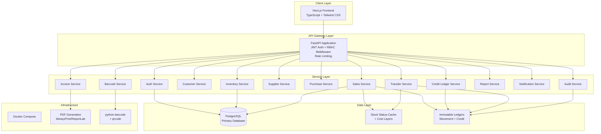
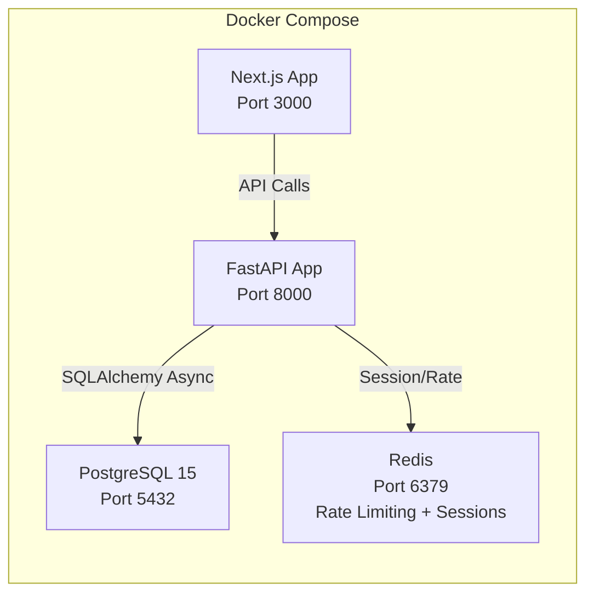
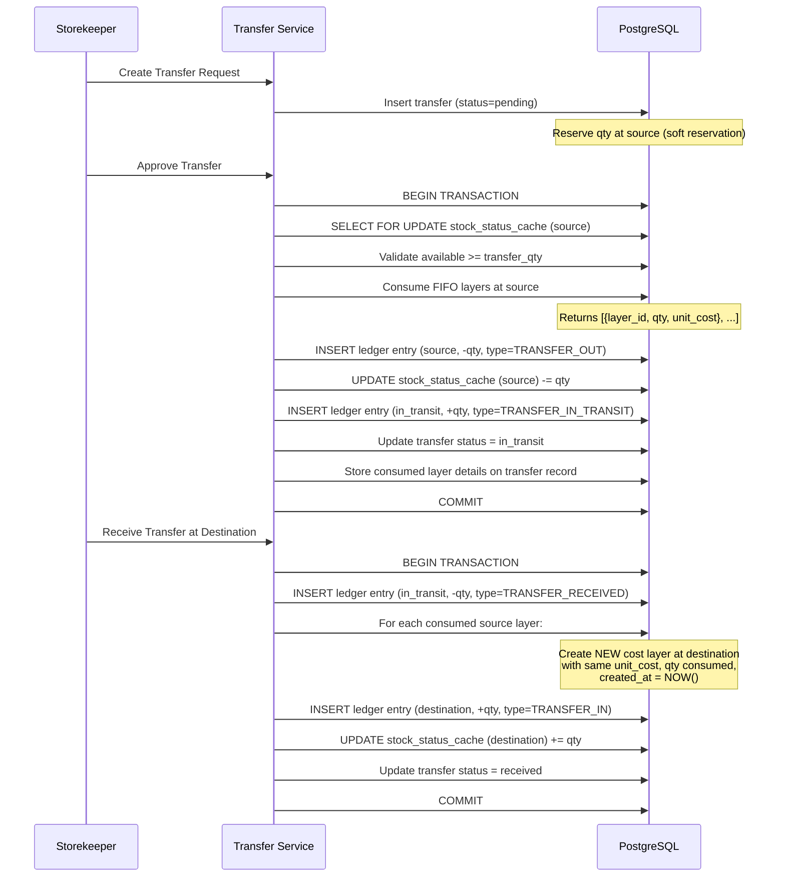
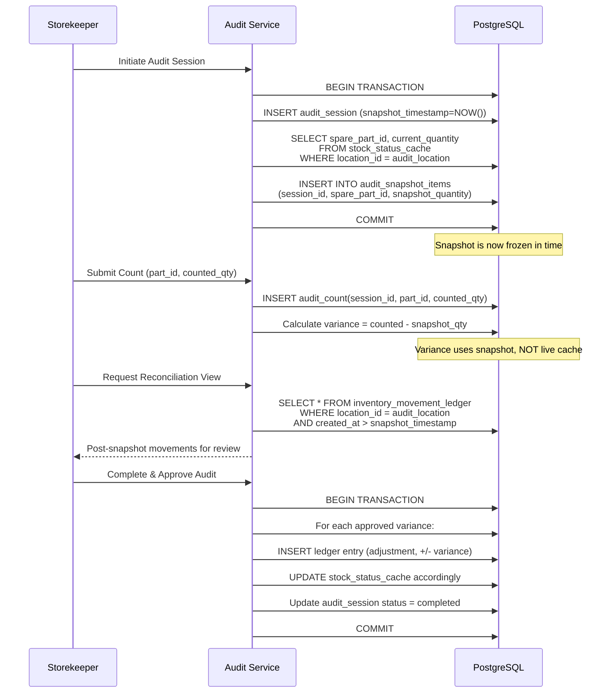

# Design Document: Auto Spare Parts ERP System

## Overview

The Auto Spare Parts ERP System is designed as a modular, multi-tier web application implementing immutable ledger architecture for financial and inventory data integrity. The system uses an event-sourced pattern where all stock quantities and customer balances are derived from append-only ledger tables, with cache tables providing performant reads.

### Key Design Decisions

1. **Immutable Ledger as Source of Truth**: Stock levels are derived from `Inventory_Movement_Ledger` and customer balances from `Customer_Credit_Ledger`. This ensures auditability and eliminates drift between summarized and detailed data.

2. **Stock_Status_Cache with Pessimistic Locking**: A cache table provides fast reads for stock queries. Sales and transfers acquire `SELECT FOR UPDATE` locks on cache rows within atomic transactions that validate stock, write to the ledger, and update the cache in one commit.

3. **FIFO Cost Layer Management**: Cost layers track inventory valuation per batch. Consumption follows chronological order. Returns create new layers (never re-open closed ones).

4. **Two-Step Transfer with In-Transit State**: Transfers follow a pending → approved (deduct source) → received (add destination) lifecycle with in-transit as an intermediate accounting state.

5. **Snapshot-Based Audit**: Audit sessions freeze system quantities at initiation time. Variance is calculated against the snapshot, isolating concurrent movements.

6. **Database-Layer Credit Enforcement**: Credit limit checks occur within the same database transaction that writes the debit entry, preventing race conditions.

### Design Rationale

- **Why immutable ledgers?** Mutable quantity columns drift under concurrent access and make forensic analysis impossible. Ledgers provide a complete audit trail and enable point-in-time reconstruction.
- **Why pessimistic locking over optimistic?** With 5–20 concurrent users and 20–100 daily sales potentially targeting the same popular parts, pessimistic locking provides deterministic ordering without retry loops.
- **Why FIFO cost layers?** FIFO is the industry standard for automotive parts valuation, providing accurate COGS and complying with accounting standards.
- **Why snapshot-based audit?** Live stock changes during a count would corrupt variance calculations. Snapshots freeze the baseline, and a reconciliation view shows post-snapshot movements.

## Architecture

### System Architecture Diagram



### Deployment Architecture



### Technology Choices

| Layer | Technology | Rationale |
|-------|-----------|-----------|
| Backend Framework | FastAPI (async) | Native async support, auto OpenAPI docs, Pydantic validation |
| ORM | SQLAlchemy 2.0 (async) | Mature ORM with async session support, explicit transaction control |
| Database | PostgreSQL 15+ | ACID compliance, partial indexes, JSON support, `SELECT FOR UPDATE` |
| Frontend | Next.js 14 + TypeScript | SSR for initial load, App Router for layouts, type safety |
| Styling | Tailwind CSS | Utility-first, rapid UI development, consistent design |
| Auth | JWT (access + refresh) | Stateless verification, refresh rotation for security |
| PDF | WeasyPrint | HTML/CSS to PDF, supports A4 and custom thermal formats |
| Barcode | python-barcode + qrcode | Code 128 generation, QR code for invoice verification |
| Containerization | Docker Compose | Consistent dev/prod environments, service orchestration |
| Rate Limiting | Redis + slowapi | In-memory token bucket, shared across workers |

## Components and Interfaces

### Backend Project Structure

```
backend/
├── app/
│   ├── main.py                    # FastAPI application factory
│   ├── config.py                  # Settings via pydantic-settings
│   ├── database.py                # Async engine + session factory
│   ├── dependencies.py            # Dependency injection (get_db, get_current_user)
│   ├── middleware/
│   │   ├── auth.py                # JWT verification middleware
│   │   ├── rate_limit.py          # Rate limiting middleware
│   │   └── security_headers.py    # Secure HTTP headers
│   ├── models/                    # SQLAlchemy ORM models
│   │   ├── base.py                # BaseModel with id, timestamps, soft-delete
│   │   ├── user.py
│   │   ├── spare_part.py
│   │   ├── location.py
│   │   ├── inventory_movement_ledger.py
│   │   ├── stock_status_cache.py
│   │   ├── cost_layer.py
│   │   ├── sale.py
│   │   ├── customer.py
│   │   ├── customer_credit_ledger.py
│   │   ├── supplier.py
│   │   ├── purchase_order.py
│   │   ├── goods_receipt_note.py
│   │   ├── transfer.py
│   │   ├── audit_session.py
│   │   ├── notification.py
│   │   ├── audit_trail.py
│   │   └── invoice.py
│   ├── schemas/                   # Pydantic request/response schemas
│   ├── services/                  # Business logic layer
│   │   ├── auth_service.py
│   │   ├── inventory_service.py
│   │   ├── sales_service.py
│   │   ├── credit_ledger_service.py
│   │   ├── transfer_service.py
│   │   ├── purchase_service.py
│   │   ├── audit_service.py
│   │   ├── barcode_service.py
│   │   ├── report_service.py
│   │   ├── notification_service.py
│   │   └── invoice_service.py
│   ├── routers/                   # FastAPI route handlers
│   └── utils/
│       ├── fifo.py                # FIFO cost layer consumption algorithm
│       ├── pdf_generator.py       # Invoice PDF generation
│       └── barcode_generator.py   # Barcode/QR code generation
├── alembic/                       # Database migrations
├── tests/
│   ├── unit/
│   ├── property/                  # Property-based tests
│   └── integration/
├── Dockerfile
└── requirements.txt
```

### Frontend Project Structure

```
frontend/
├── src/
│   ├── app/                       # Next.js App Router
│   │   ├── (auth)/                # Auth layout group
│   │   │   ├── login/
│   │   │   └── reset-password/
│   │   ├── (dashboard)/           # Main app layout group
│   │   │   ├── dashboard/
│   │   │   ├── inventory/
│   │   │   ├── sales/
│   │   │   ├── customers/
│   │   │   ├── suppliers/
│   │   │   ├── purchases/
│   │   │   ├── transfers/
│   │   │   ├── audits/
│   │   │   ├── reports/
│   │   │   └── settings/
│   │   └── layout.tsx
│   ├── components/                # Shared UI components
│   ├── lib/
│   │   ├── api.ts                 # API client with auth interceptors
│   │   ├── auth.ts                # JWT token management
│   │   └── types.ts               # TypeScript interfaces
│   └── hooks/                     # Custom React hooks
├── tailwind.config.ts
├── next.config.js
└── Dockerfile
```

### API Interface Design

All API endpoints follow RESTful conventions with consistent response envelopes:

```typescript
// Success response
{ "data": T, "meta": { "page": number, "total": number } }

// Error response
{ "error": { "code": string, "message": string, "details": object } }
```

#### Core API Endpoints

| Module | Endpoint | Method | Roles | Description |
|--------|----------|--------|-------|-------------|
| Auth | `/api/v1/auth/login` | POST | Public | Authenticate, return JWT |
| Auth | `/api/v1/auth/refresh` | POST | Public | Refresh access token |
| Auth | `/api/v1/auth/logout` | POST | All | Invalidate refresh token |
| Users | `/api/v1/users` | GET/POST | Admin | List/create users |
| Parts | `/api/v1/spare-parts` | GET/POST | All/SK,Admin | List/create parts |
| Parts | `/api/v1/spare-parts/{id}` | GET/PUT/DEL | All/SK,Admin | CRUD single part |
| Parts | `/api/v1/spare-parts/search` | GET | All | Search parts |
| Parts | `/api/v1/spare-parts/{id}/barcode` | GET | All | Get barcode image |
| Stock | `/api/v1/stock/locations/{id}` | GET | All | Stock at location |
| Stock | `/api/v1/stock/movements` | GET | SK,Mgr,Admin | Movement ledger |
| Sales | `/api/v1/sales` | GET/POST | SP,Mgr,Admin | List/create sales |
| Sales | `/api/v1/sales/{id}/confirm` | POST | SP,Mgr,Admin | Confirm sale |
| Sales | `/api/v1/sales/{id}/return` | POST | Mgr,Admin | Process return |
| Invoices | `/api/v1/invoices/{id}/pdf` | GET | SP,Mgr,Admin | Download PDF |
| Customers | `/api/v1/customers` | GET/POST | SP,Mgr,Admin | List/create |
| Customers | `/api/v1/customers/{id}/ledger` | GET | Mgr,Admin | Credit ledger |
| Customers | `/api/v1/customers/{id}/aging` | GET | Mgr,Admin | Aging analysis |
| Credit | `/api/v1/credit/payments` | POST | SP,Mgr,Admin | Record payment |
| Credit | `/api/v1/credit/adjustments` | POST | Mgr,Admin | Manual adjustment |
| Suppliers | `/api/v1/suppliers` | GET/POST | Mgr,Admin | List/create |
| Purchases | `/api/v1/purchase-orders` | GET/POST | Mgr,Admin | List/create PO |
| Purchases | `/api/v1/purchase-orders/{id}/approve` | POST | Mgr,Admin | Approve PO |
| Purchases | `/api/v1/purchase-orders/{id}/receive` | POST | SK,Mgr,Admin | Goods receipt |
| Transfers | `/api/v1/transfers` | GET/POST | SK,Mgr,Admin | List/create |
| Transfers | `/api/v1/transfers/{id}/approve` | POST | Mgr,Admin | Approve transfer |
| Transfers | `/api/v1/transfers/{id}/receive` | POST | SK,Mgr,Admin | Receive transfer |
| Audits | `/api/v1/audits` | GET/POST | SK,Mgr,Admin | List/create session |
| Audits | `/api/v1/audits/{id}/counts` | POST | SK | Submit counts |
| Audits | `/api/v1/audits/{id}/approve` | POST | Mgr,Admin | Approve variances |
| Reports | `/api/v1/reports/{type}` | GET | Mgr,Admin | Generate report |
| Dashboard | `/api/v1/dashboard/kpis` | GET | All | KPI widgets |
| Notifications | `/api/v1/notifications` | GET | All | User notifications |

### Service Layer Patterns

#### Atomic Transaction Pattern (SQLAlchemy 2.0 Async)

All operations that modify financial or inventory data use the atomic transaction pattern:

```python
from sqlalchemy.ext.asyncio import AsyncSession
from sqlalchemy import select

class SalesService:
    def __init__(self, db: AsyncSession):
        self.db = db

    async def confirm_sale(self, sale_id: UUID, location_id: UUID) -> Sale:
        async with self.db.begin():
            sale = await self._get_sale_with_items(sale_id)
            
            for item in sale.items:
                # Acquire pessimistic lock on cache row
                stmt = (
                    select(StockStatusCache)
                    .filter_by(
                        spare_part_id=item.spare_part_id,
                        location_id=location_id
                    )
                    .with_for_update()
                )
                result = await self.db.execute(stmt)
                cache = result.scalar_one_or_none()
                
                if not cache or cache.current_quantity < item.quantity:
                    raise InsufficientStockError(
                        part_id=item.spare_part_id,
                        requested=item.quantity,
                        available=cache.current_quantity if cache else 0
                    )
                
                # Calculate COGS via FIFO
                cogs = await self._consume_fifo_layers(
                    item.spare_part_id, location_id, item.quantity
                )
                item.cost_of_goods_sold = cogs
                
                # Write to ledger
                ledger_entry = InventoryMovementLedger(
                    spare_part_id=item.spare_part_id,
                    location_id=location_id,
                    quantity_change=-item.quantity,
                    movement_type=MovementType.SALE,
                    reference_type="sale",
                    reference_id=sale.id,
                    unit_cost=cogs / item.quantity,
                )
                self.db.add(ledger_entry)
                
                # Update cache atomically
                cache.current_quantity -= item.quantity
            
            # Handle credit if applicable
            if sale.payment_type == PaymentType.CREDIT:
                await self._record_credit_debit(sale)
            
            sale.status = SaleStatus.CONFIRMED
            sale.invoice_number = await self._generate_invoice_number()
            
            return sale
```

#### Dependency Injection Pattern

```python
from fastapi import Depends
from app.database import get_async_session

async def get_sales_service(
    db: AsyncSession = Depends(get_async_session),
    current_user: User = Depends(get_current_user),
) -> SalesService:
    return SalesService(db=db, user=current_user)
```

### Key Algorithms

#### FIFO Cost Layer Consumption Algorithm

This algorithm is invoked whenever stock is consumed (sales, transfers out). It selects cost layers in chronological order and deducts quantities until the requested amount is fulfilled.

```python
from sqlalchemy import select
from decimal import Decimal

async def consume_fifo_layers(
    db: AsyncSession,
    spare_part_id: UUID,
    location_id: UUID,
    quantity_to_consume: Decimal,
) -> Decimal:
    """
    Consume cost layers in FIFO order for a given part at a location.
    Returns total cost of goods consumed.
    
    Algorithm:
    1. Query cost layers WHERE remaining_quantity > 0, ordered by created_at ASC
    2. For each layer, consume min(layer.remaining_quantity, remaining_needed)
    3. Accumulate cost as consumed_qty * layer.unit_cost
    4. Update layer remaining_quantity
    5. If remaining_needed becomes 0, stop
    6. If all layers exhausted before fulfillment, raise InsufficientCostLayerError
    """
    stmt = (
        select(CostLayer)
        .filter_by(spare_part_id=spare_part_id, location_id=location_id)
        .filter(CostLayer.remaining_quantity > 0)
        .order_by(CostLayer.created_at.asc())
        .with_for_update()
    )
    result = await db.execute(stmt)
    layers = result.scalars().all()
    
    total_cost = Decimal("0")
    remaining_needed = quantity_to_consume
    consumed_details = []  # Track for audit/reporting
    
    for layer in layers:
        if remaining_needed <= 0:
            break
        
        consume_from_layer = min(layer.remaining_quantity, remaining_needed)
        layer_cost = consume_from_layer * layer.unit_cost
        
        layer.remaining_quantity -= consume_from_layer
        total_cost += layer_cost
        remaining_needed -= consume_from_layer
        
        consumed_details.append({
            "layer_id": layer.id,
            "quantity_consumed": consume_from_layer,
            "unit_cost": layer.unit_cost,
            "layer_cost": layer_cost,
        })
    
    if remaining_needed > 0:
        raise InsufficientCostLayerError(
            spare_part_id=spare_part_id,
            location_id=location_id,
            shortfall=remaining_needed,
        )
    
    return total_cost
```

#### Transfer Cost-Layer Propagation Flow



**Transfer Cost Layer Rules:**
1. At approval: consume from source layers using FIFO, record the consumed layer details (unit_cost, quantity per layer) on the transfer record
2. At receipt: for each consumed source layer segment, create a **new** cost layer at the destination with the same unit_cost but `created_at = NOW()`
3. Never move or modify source layers — always consume + create new
4. A single transfer consuming from multiple source layers creates multiple destination layers (preserving cost granularity)

#### Audit Snapshot Mechanism



**Snapshot Rules:**
1. Snapshot captures stock_status_cache values at the exact moment of audit initiation
2. All variance calculations compare physical count to snapshot quantity
3. Movements after snapshot timestamp are excluded from variance but shown in reconciliation view
4. Adjustment entries use the variance between physical count and snapshot (not current live quantity)
5. Any stock movements at the audited location during an active audit session are flagged for re-count verification

#### Credit Limit Enforcement Algorithm

```python
async def validate_and_record_credit_debit(
    db: AsyncSession,
    customer_id: UUID,
    amount: Decimal,
    transaction_type: str,
    reference_id: UUID,
) -> CustomerCreditLedger:
    """
    Validates credit limit and records debit entry atomically.
    Called within the same transaction that confirms the sale.
    
    Algorithm:
    1. Lock customer record (SELECT FOR UPDATE)
    2. Calculate current balance from ledger SUM
    3. Check if (current_balance + amount) > credit_limit
    4. If exceeded, raise CreditLimitExceededError
    5. If within limit, INSERT debit entry
    """
    # Lock customer to prevent concurrent credit checks
    stmt = (
        select(Customer)
        .filter_by(id=customer_id)
        .with_for_update()
    )
    result = await db.execute(stmt)
    customer = result.scalar_one()
    
    # Calculate current outstanding balance
    balance_stmt = (
        select(func.coalesce(func.sum(CustomerCreditLedger.amount), Decimal("0")))
        .filter_by(customer_id=customer_id)
    )
    balance_result = await db.execute(balance_stmt)
    current_balance = balance_result.scalar()
    
    # Validate credit limit
    new_balance = current_balance + amount
    if new_balance > customer.credit_limit:
        raise CreditLimitExceededError(
            customer_id=customer_id,
            current_balance=current_balance,
            attempted_amount=amount,
            credit_limit=customer.credit_limit,
        )
    
    # Record debit entry
    entry = CustomerCreditLedger(
        customer_id=customer_id,
        transaction_type=transaction_type,
        amount=amount,  # Positive for debits, negative for credits
        reference_type="sale",
        reference_id=reference_id,
    )
    db.add(entry)
    
    return entry
```

## Data Models

### Entity-Relationship Diagram

```mermaid
erDiagram
    users {
        uuid id PK
        string username UK
        string email UK
        string password_hash
        string role
        boolean is_active
        timestamp locked_until
        int failed_login_attempts
        timestamp created_at
        timestamp updated_at
        string created_by
        string updated_by
        timestamp deleted_at
        string deleted_by
    }

    locations {
        uuid id PK
        string name
        string type
        string address
        boolean is_active
        timestamp created_at
        timestamp updated_at
    }

    spare_parts {
        uuid id PK
        string part_number
        string barcode
        string name
        string description
        string brand
        uuid category_id FK
        uuid subcategory_id FK
        json vehicle_compatibility
        string unit_of_measure
        decimal cost_price
        decimal selling_price
        decimal min_stock_level
        decimal max_stock_level
        decimal reorder_quantity
        timestamp created_at
        timestamp updated_at
        timestamp deleted_at
    }

    stock_status_cache {
        uuid id PK
        uuid spare_part_id FK
        uuid location_id FK
        decimal current_quantity
        timestamp last_reconciled_at
        timestamp updated_at
    }

    cost_layers {
        uuid id PK
        uuid spare_part_id FK
        uuid location_id FK
        decimal unit_cost
        decimal original_quantity
        decimal remaining_quantity
        string source_type
        uuid source_reference_id
        timestamp created_at
    }

    inventory_movement_ledger {
        uuid id PK
        uuid spare_part_id FK
        uuid location_id FK
        decimal quantity_change
        string movement_type
        string reference_type
        uuid reference_id
        decimal unit_cost
        uuid created_by FK
        timestamp created_at
    }

    customers {
        uuid id PK
        string name
        string phone
        string email
        string address
        string tax_id
        decimal credit_limit
        string account_status
        timestamp created_at
        timestamp updated_at
        timestamp deleted_at
    }

    customer_credit_ledger {
        uuid id PK
        uuid customer_id FK
        string transaction_type
        decimal amount
        string reference_type
        uuid reference_id
        string notes
        uuid created_by FK
        timestamp created_at
    }

    sales {
        uuid id PK
        uuid customer_id FK
        uuid location_id FK
        string invoice_number
        string status
        string payment_type
        decimal subtotal
        decimal tax_amount
        decimal total_amount
        decimal discount_total
        uuid created_by FK
        timestamp created_at
        timestamp updated_at
    }

    sale_items {
        uuid id PK
        uuid sale_id FK
        uuid spare_part_id FK
        decimal quantity
        decimal unit_price
        decimal discount_amount
        decimal line_total
        decimal cost_of_goods_sold
        timestamp created_at
    }

    suppliers {
        uuid id PK
        string name
        string contact_person
        string phone
        string email
        string address
        string tax_id
        string payment_terms
        string account_status
        timestamp created_at
        timestamp updated_at
        timestamp deleted_at
    }

    purchase_orders {
        uuid id PK
        uuid supplier_id FK
        string status
        decimal total_amount
        string notes
        uuid created_by FK
        uuid approved_by FK
        timestamp approved_at
        timestamp created_at
        timestamp updated_at
    }

    purchase_order_items {
        uuid id PK
        uuid purchase_order_id FK
        uuid spare_part_id FK
        decimal quantity_ordered
        decimal quantity_received
        decimal unit_cost
        timestamp created_at
    }

    goods_receipt_notes {
        uuid id PK
        uuid purchase_order_id FK
        uuid location_id FK
        uuid received_by FK
        timestamp received_at
        string notes
        timestamp created_at
    }

    grn_items {
        uuid id PK
        uuid grn_id FK
        uuid po_item_id FK
        uuid spare_part_id FK
        decimal quantity_received
        decimal unit_cost
        timestamp created_at
    }

    transfers {
        uuid id PK
        uuid spare_part_id FK
        uuid source_location_id FK
        uuid destination_location_id FK
        decimal quantity
        string status
        json consumed_layer_details
        uuid requested_by FK
        uuid approved_by FK
        uuid received_by FK
        timestamp approved_at
        timestamp received_at
        string cancellation_reason
        timestamp created_at
        timestamp updated_at
    }

    audit_sessions {
        uuid id PK
        uuid location_id FK
        string audit_type
        string status
        timestamp snapshot_timestamp
        uuid initiated_by FK
        uuid approved_by FK
        timestamp completed_at
        timestamp created_at
    }

    audit_snapshot_items {
        uuid id PK
        uuid session_id FK
        uuid spare_part_id FK
        decimal snapshot_quantity
    }

    audit_counts {
        uuid id PK
        uuid session_id FK
        uuid spare_part_id FK
        decimal counted_quantity
        decimal variance
        uuid counted_by FK
        timestamp counted_at
    }

    notifications {
        uuid id PK
        uuid user_id FK
        string notification_type
        string title
        string message
        json metadata
        boolean is_read
        timestamp created_at
        timestamp read_at
    }

    audit_trail {
        uuid id PK
        uuid user_id FK
        string action_type
        string entity_type
        uuid entity_id
        json old_values
        json new_values
        string ip_address
        timestamp created_at
    }

    invoices {
        uuid id PK
        uuid sale_id FK
        string invoice_number
        bytes pdf_data
        string format
        timestamp created_at
    }

    users ||--o{ sales : "creates"
    customers ||--o{ sales : "purchases"
    locations ||--o{ sales : "sells_from"
    sales ||--o{ sale_items : "contains"
    spare_parts ||--o{ sale_items : "sold_in"
    customers ||--o{ customer_credit_ledger : "has_entries"
    spare_parts ||--o{ stock_status_cache : "tracked_at"
    locations ||--o{ stock_status_cache : "stores"
    spare_parts ||--o{ cost_layers : "valued_by"
    locations ||--o{ cost_layers : "at"
    spare_parts ||--o{ inventory_movement_ledger : "moved"
    locations ||--o{ inventory_movement_ledger : "at"
    suppliers ||--o{ purchase_orders : "receives"
    purchase_orders ||--o{ purchase_order_items : "contains"
    purchase_orders ||--o{ goods_receipt_notes : "received_by"
    audit_sessions ||--o{ audit_snapshot_items : "captures"
    audit_sessions ||--o{ audit_counts : "records"
```



### PostgreSQL Indexing Strategy

```sql
-- Partial unique indexes for soft-delete compatibility (Requirement 18.5, 18.7)
CREATE UNIQUE INDEX uix_spare_parts_part_number_active 
    ON spare_parts (part_number) WHERE deleted_at IS NULL;
CREATE UNIQUE INDEX uix_spare_parts_barcode_active 
    ON spare_parts (barcode) WHERE deleted_at IS NULL;

-- Composite unique on stock cache (Requirement 18.8)
CREATE UNIQUE INDEX uix_stock_status_cache_part_location 
    ON stock_status_cache (spare_part_id, location_id);

-- Composite index on movement ledger for reconciliation and snapshots (Requirement 18.9)
CREATE INDEX ix_movement_ledger_part_location_time 
    ON inventory_movement_ledger (spare_part_id, location_id, created_at);

-- Partial composite on cost layers for FIFO queries (Requirement 18.10)
CREATE INDEX ix_cost_layers_active_fifo 
    ON cost_layers (spare_part_id, location_id, created_at) 
    WHERE remaining_quantity > 0;

-- Additional performance indexes
CREATE INDEX ix_credit_ledger_customer 
    ON customer_credit_ledger (customer_id, created_at);
CREATE INDEX ix_audit_trail_entity 
    ON audit_trail (entity_type, entity_id, created_at);
CREATE INDEX ix_notifications_user_unread 
    ON notifications (user_id, is_read, created_at) WHERE is_read = FALSE;
CREATE INDEX ix_transfers_status 
    ON transfers (status) WHERE status IN ('pending', 'in_transit');
```

### SQLAlchemy Base Model

```python
from sqlalchemy import Column, DateTime, String, func
from sqlalchemy.dialects.postgresql import UUID
from sqlalchemy.orm import DeclarativeBase, Mapped, mapped_column
import uuid
from datetime import datetime

class Base(DeclarativeBase):
    pass

class BaseModel(Base):
    __abstract__ = True
    
    id: Mapped[uuid.UUID] = mapped_column(
        UUID(as_uuid=True), primary_key=True, default=uuid.uuid4
    )
    created_at: Mapped[datetime] = mapped_column(
        DateTime(timezone=True), server_default=func.now()
    )
    updated_at: Mapped[datetime] = mapped_column(
        DateTime(timezone=True), server_default=func.now(), onupdate=func.now()
    )
    created_by: Mapped[uuid.UUID | None] = mapped_column(
        UUID(as_uuid=True), nullable=True
    )
    updated_by: Mapped[uuid.UUID | None] = mapped_column(
        UUID(as_uuid=True), nullable=True
    )

class SoftDeleteMixin:
    deleted_at: Mapped[datetime | None] = mapped_column(
        DateTime(timezone=True), nullable=True
    )
    deleted_by: Mapped[uuid.UUID | None] = mapped_column(
        UUID(as_uuid=True), nullable=True
    )
```

## Correctness Properties

*A property is a characteristic or behavior that should hold true across all valid executions of a system — essentially, a formal statement about what the system should do. Properties serve as the bridge between human-readable specifications and machine-verifiable correctness guarantees.*

### Property 1: FIFO Consumption Order

*For any* spare part at any location with multiple cost layers, when a quantity is consumed (via sale or transfer), the layers SHALL be consumed in chronological order of `created_at`, starting with the oldest layer that has `remaining_quantity > 0`, and the total cost returned SHALL equal the sum of `consumed_qty × layer.unit_cost` for each layer touched.

**Validates: Requirements 1.5, 1.10, 3.7, 4.11**

### Property 2: Ledger-Derived Customer Balance

*For any* customer and any sequence of credit ledger entries (debits from sales, credits from payments, adjustments, returns), the computed customer balance SHALL always equal the algebraic sum of all `amount` values in the `Customer_Credit_Ledger` for that customer.

**Validates: Requirements 1.3, 6.4**

### Property 3: Ledger-Derived Supplier Balance

*For any* supplier and any sequence of purchase and payment records, the computed supplier balance SHALL always equal the algebraic sum of all purchase amounts minus all payment amounts for that supplier.

**Validates: Requirements 1.4, 8.3, 8.5**

### Property 4: Soft Delete Preserves Data

*For any* financial record that is deleted, the physical row SHALL continue to exist in the database with `deleted_at` set to a non-null timestamp and `deleted_by` set to the deleting user's ID, and the record SHALL NOT appear in default (non-deleted) query results.

**Validates: Requirements 1.2**

### Property 5: GRN Creates Cost Layers

*For any* Goods Receipt Note with N line items, upon confirmation, the system SHALL create exactly N new cost layers, each with `unit_cost` matching the GRN line item cost, `original_quantity` and `remaining_quantity` matching the received quantity, and `location_id` matching the GRN receiving location.

**Validates: Requirements 1.9**

### Property 6: Double-Entry Balance

*For any* financial transaction recorded in the system, there SHALL exist corresponding debit and credit entries whose absolute amounts are equal, ensuring the accounting equation remains balanced.

**Validates: Requirements 1.7**

### Property 7: Stock Cache Equals Ledger Sum

*For any* spare part at any location, the `current_quantity` in the `Stock_Status_Cache` SHALL equal the sum of all `quantity_change` values in the `Inventory_Movement_Ledger` for that `(spare_part_id, location_id)` pair.

**Validates: Requirements 3.6, 18.2**

### Property 8: Password Complexity Validation

*For any* string, the password validator SHALL accept it if and only if it has length >= 8, contains at least one uppercase letter, at least one lowercase letter, and at least one digit. All other strings SHALL be rejected.

**Validates: Requirements 2.5**

### Property 9: Unique Part Number and Barcode

*For any* two active (non-soft-deleted) spare parts, their `part_number` values SHALL be distinct and their `barcode` values SHALL be distinct. Soft-deleted records SHALL NOT conflict with active records.

**Validates: Requirements 3.2, 18.5**

### Property 10: Transfer Source Deduction and Destination Creation

*For any* transfer that is approved then received, the source location's stock SHALL decrease by the transfer quantity, the destination location's stock SHALL increase by the same quantity, and new cost layers SHALL be created at the destination with unit costs matching the consumed source layers — without modifying or moving any source cost layer records.

**Validates: Requirements 4.5, 4.6, 4.10, 4.12**

### Property 11: In-Transit Stock Unavailability

*For any* transfer in `in_transit` status, the transferred quantity SHALL NOT be included in the available-for-sale stock at either the source location or the destination location.

**Validates: Requirements 4.7**

### Property 12: Transfer Quantity Validation

*For any* transfer request where the requested quantity exceeds the available stock (accounting for existing reservations) at the source location, the system SHALL reject the request with an insufficient stock error.

**Validates: Requirements 4.9**

### Property 13: Sale Line Total Calculation

*For any* sale line item with quantity Q, unit price P, and discount D, the line total SHALL equal `(Q × P) - D`.

**Validates: Requirements 5.7**

### Property 14: Sale Stock Deduction via Ledger

*For any* confirmed sale with line items, the selling location's stock SHALL decrease by the sum of all line item quantities, and corresponding negative `quantity_change` entries SHALL exist in the Inventory_Movement_Ledger.

**Validates: Requirements 5.2**

### Property 15: Return Creates New Cost Layer (Never Re-opens)

*For any* sales return, a new cost layer SHALL be created at the return location with `unit_cost` equal to the original sale line item's unit cost, `created_at` set to the return processing date (not the original receipt date), and no previously consumed or closed cost layers SHALL be modified.

**Validates: Requirements 5.12, 5.13, 5.14**

### Property 16: Credit Limit Enforcement

*For any* debit entry (from a sale or an adjustment) that would cause the customer's total outstanding balance to exceed their credit limit, the transaction SHALL be rejected with a credit limit exceeded error. The check SHALL occur at transaction confirmation time within the database transaction.

**Validates: Requirements 7.2, 7.7, 7.8, 7.9**

### Property 17: Aging Analysis Bucketing

*For any* set of outstanding credit ledger entries, the aging analysis SHALL correctly partition them into buckets (current, 1-30 days, 31-60 days, 61-90 days, 90+ days) based on the number of days between the entry's creation date and the analysis date, and the sum of all bucket amounts SHALL equal the total outstanding balance.

**Validates: Requirements 7.3**

### Property 18: Credit Ledger Round-Trip

*For any* sequence of credit ledger entries, serializing the computed balance to its storage/display format and then parsing it back SHALL produce a value equivalent to the original computed balance.

**Validates: Requirements 7.6**

### Property 19: Barcode Encode-Decode Round-Trip

*For any* valid spare part identifier, encoding it as a Code 128 barcode and then decoding the barcode image SHALL produce the original identifier.

**Validates: Requirements 10.6**

### Property 20: Invoice QR Code Round-Trip

*For any* generated invoice, decoding the QR code embedded in the invoice PDF SHALL produce the original invoice number and total amount.

**Validates: Requirements 14.6**

### Property 21: Audit Snapshot Isolation

*For any* audit session, the variance for each spare part SHALL be calculated as `counted_quantity - snapshot_quantity` (where snapshot_quantity was captured at audit initiation), and any inventory movements occurring after the snapshot timestamp SHALL NOT affect the variance calculation.

**Validates: Requirements 11.7, 11.8, 11.9**

### Property 22: Audit Adjustment Correctness

*For any* approved audit variance, the system SHALL create a ledger adjustment entry whose `quantity_change` equals `counted_quantity - snapshot_quantity`, bringing the system stock in line with the physical count.

**Validates: Requirements 11.4**

### Property 23: Sequential Invoice Numbers

*For any* sequence of confirmed sales, the generated invoice numbers SHALL be unique and monotonically increasing (sequential).

**Validates: Requirements 5.5**

### Property 24: Audit Trail Immutability

*For any* audit trail record, no operation (including Admin-level operations) SHALL be able to modify or delete the record. The audit trail table SHALL be append-only.

**Validates: Requirements 15.6**

### Property 25: RBAC Endpoint Enforcement

*For any* API endpoint with a defined role restriction, requests from users whose role is not in the allowed set SHALL receive a 403 Forbidden response, regardless of the request payload.

**Validates: Requirements 17.1**

### Property 26: Low Stock Notification Trigger

*For any* spare part whose stock level (at any location) falls below its configured `min_stock_level`, the system SHALL generate a low stock notification for Storekeeper and Manager roles.

**Validates: Requirements 3.3, 16.1**

### Property 27: Purchase Order Total

*For any* purchase order, the total amount SHALL equal the sum of `quantity_ordered × unit_cost` for all line items.

**Validates: Requirements 9.8**

## Error Handling

### Error Classification

| Error Type | HTTP Status | Retry | Description |
|-----------|-------------|-------|-------------|
| `InsufficientStockError` | 409 Conflict | No | Requested quantity exceeds available stock |
| `CreditLimitExceededError` | 422 Unprocessable | No | Transaction would exceed credit limit |
| `InsufficientCostLayerError` | 500 Internal | No | Cost layers depleted (data integrity issue) |
| `ConcurrencyConflictError` | 409 Conflict | Yes | Pessimistic lock contention |
| `InvalidStateTransitionError` | 422 Unprocessable | No | Entity not in valid state for operation |
| `AuthenticationError` | 401 Unauthorized | No | Invalid or expired credentials |
| `AuthorizationError` | 403 Forbidden | No | Insufficient role permissions |
| `RateLimitExceededError` | 429 Too Many | Yes | Request rate exceeded |
| `AccountLockedError` | 423 Locked | No | Account locked due to failed attempts |
| `ValidationError` | 422 Unprocessable | No | Request payload fails validation |
| `NotFoundError` | 404 Not Found | No | Requested resource does not exist |
| `ReconciliationDriftError` | N/A (internal) | Auto | Cache drift detected during reconciliation |

### Error Response Format

```json
{
  "error": {
    "code": "INSUFFICIENT_STOCK",
    "message": "Insufficient stock for part ABC-123 at Warehouse A",
    "details": {
      "spare_part_id": "uuid",
      "location_id": "uuid",
      "requested_quantity": 10,
      "available_quantity": 3
    }
  }
}
```

### Transaction Rollback Strategy

All inventory and financial operations use atomic transactions. If any step fails within a transaction:

1. **Sale confirmation**: If any line item fails stock validation, the entire sale is rolled back (no partial sales)
2. **Transfer approval**: If source stock insufficient, entire transfer rolled back
3. **Credit limit check**: If credit limit exceeded, the sale confirmation is rolled back
4. **Cost layer consumption**: If layers exhausted unexpectedly, operation fails with `InsufficientCostLayerError` (indicates data integrity issue requiring investigation)

### Reconciliation Error Handling

When periodic reconciliation detects drift between `Stock_Status_Cache` and `Inventory_Movement_Ledger`:

```python
async def reconcile_stock_cache(db: AsyncSession):
    """
    Compare cache against ledger truth. Fix drift and alert.
    """
    stmt = text("""
        SELECT 
            ssc.spare_part_id,
            ssc.location_id,
            ssc.current_quantity AS cache_qty,
            COALESCE(SUM(iml.quantity_change), 0) AS ledger_qty
        FROM stock_status_cache ssc
        LEFT JOIN inventory_movement_ledger iml
            ON iml.spare_part_id = ssc.spare_part_id
            AND iml.location_id = ssc.location_id
        GROUP BY ssc.spare_part_id, ssc.location_id, ssc.current_quantity
        HAVING ssc.current_quantity != COALESCE(SUM(iml.quantity_change), 0)
    """)
    
    result = await db.execute(stmt)
    mismatches = result.all()
    
    for mismatch in mismatches:
        logger.error(
            "Stock cache drift detected",
            extra={
                "spare_part_id": mismatch.spare_part_id,
                "location_id": mismatch.location_id,
                "cache_qty": mismatch.cache_qty,
                "ledger_qty": mismatch.ledger_qty,
            }
        )
        # Correct cache
        await db.execute(
            update(StockStatusCache)
            .filter_by(
                spare_part_id=mismatch.spare_part_id,
                location_id=mismatch.location_id
            )
            .values(
                current_quantity=mismatch.ledger_qty,
                last_reconciled_at=func.now()
            )
        )
        # Generate admin alert
        await create_notification(
            db,
            notification_type="RECONCILIATION_DRIFT",
            roles=[Role.ADMIN],
            metadata={...}
        )
```

## Testing Strategy

### Overview

The testing strategy employs a dual approach:
- **Property-based tests** verify universal correctness properties across randomly generated inputs (minimum 100 iterations per test)
- **Unit tests** verify specific examples, edge cases, and integration behavior
- **Integration tests** verify database transactions, concurrency, and cross-service behavior

### Property-Based Testing Framework

- **Library**: [Hypothesis](https://hypothesis.readthedocs.io/) for Python
- **Configuration**: Minimum 100 examples per property test (`@settings(max_examples=100)`)
- **Tag Format**: `# Feature: auto-spare-parts-erp, Property {N}: {description}`

### Property Test Mapping

| Property | Test Description | Key Generators |
|----------|-----------------|----------------|
| 1 | FIFO consumption order | Random cost layer sequences (varying qty, cost, dates) |
| 2 | Customer balance = ledger sum | Random debit/credit entry sequences |
| 3 | Supplier balance = transaction sum | Random purchase/payment sequences |
| 4 | Soft delete preserves data | Random financial entity types |
| 5 | GRN creates correct cost layers | Random GRN line items |
| 6 | Double-entry balance | Random financial transactions |
| 7 | Stock cache = ledger sum | Random movement ledger entries |
| 8 | Password complexity validation | Random strings (valid/invalid) |
| 9 | Unique part number/barcode | Random part creation sequences |
| 10 | Transfer deduction + destination creation | Random transfer scenarios with multi-layer sources |
| 11 | In-transit unavailability | Random transfer states |
| 12 | Transfer quantity validation | Random qty vs available combinations |
| 13 | Sale line total | Random qty, price, discount values |
| 14 | Sale stock deduction | Random sale line items |
| 15 | Return creates new layer (immutable) | Random returns with varied original layers |
| 16 | Credit limit enforcement | Random balance/limit/amount combinations |
| 17 | Aging bucket correctness | Random dated entries |
| 18 | Credit ledger round-trip | Random balance values (Decimal precision) |
| 19 | Barcode encode-decode round-trip | Random alphanumeric identifiers |
| 20 | Invoice QR round-trip | Random invoice numbers and amounts |
| 21 | Audit snapshot isolation | Random pre/post-snapshot movements |
| 22 | Audit adjustment correctness | Random variances |
| 23 | Sequential invoice numbers | Random sale confirmation sequences |
| 24 | Audit trail immutability | Random modification/deletion attempts |
| 25 | RBAC enforcement | All role × endpoint combinations |
| 26 | Low stock notification trigger | Random stock levels vs min thresholds |
| 27 | PO total calculation | Random PO line items |

### Unit Test Focus Areas

- **Edge cases**: Zero quantities, boundary credit limits, empty searches, single-item operations
- **State machine transitions**: Valid and invalid PO/transfer state transitions
- **Authentication flows**: Login, refresh, reset, lockout
- **Validation rules**: Required fields, format validation, business rule checks

### Integration Test Focus Areas

- **Concurrency**: Parallel sale confirmations targeting same stock (pessimistic locking)
- **Transaction atomicity**: Failure mid-transaction results in complete rollback
- **Credit limit race conditions**: Concurrent credit sales from same customer
- **Performance**: Barcode lookup < 500ms, dashboard KPIs < 3s
- **Reconciliation**: Cache drift detection and correction
- **Report generation**: Correct filtering and aggregation across data volumes

### Test Directory Structure

```
tests/
├── unit/
│   ├── test_auth.py
│   ├── test_inventory.py
│   ├── test_sales.py
│   ├── test_credit.py
│   ├── test_transfers.py
│   ├── test_purchases.py
│   ├── test_audit.py
│   └── test_barcode.py
├── property/
│   ├── test_fifo_properties.py          # Properties 1, 10, 12, 15
│   ├── test_ledger_properties.py        # Properties 2, 3, 6, 7, 14
│   ├── test_credit_properties.py        # Properties 16, 17, 18
│   ├── test_roundtrip_properties.py     # Properties 19, 20
│   ├── test_audit_properties.py         # Properties 21, 22, 24
│   ├── test_validation_properties.py    # Properties 4, 8, 9, 13, 23, 25, 26, 27
│   └── test_transfer_properties.py      # Properties 10, 11
├── integration/
│   ├── test_concurrency.py
│   ├── test_reconciliation.py
│   ├── test_performance.py
│   └── test_end_to_end.py
└── conftest.py                          # Shared fixtures, test DB setup
```

### Hypothesis Custom Strategies (Generators)

```python
from hypothesis import strategies as st
from decimal import Decimal

# Cost layer generator
cost_layers = st.lists(
    st.fixed_dictionaries({
        "unit_cost": st.decimals(min_value=Decimal("0.01"), max_value=Decimal("10000"), places=2),
        "remaining_quantity": st.decimals(min_value=Decimal("1"), max_value=Decimal("1000"), places=2),
        "created_at": st.datetimes(),
    }),
    min_size=1,
    max_size=20,
).map(lambda layers: sorted(layers, key=lambda l: l["created_at"]))

# Credit ledger entry generator
credit_entries = st.lists(
    st.fixed_dictionaries({
        "transaction_type": st.sampled_from(["sale", "payment", "adjustment", "return"]),
        "amount": st.decimals(min_value=Decimal("-10000"), max_value=Decimal("10000"), places=2),
        "created_at": st.datetimes(),
    }),
    min_size=0,
    max_size=50,
)

# Password generator (for complexity testing)
passwords = st.text(
    alphabet=st.characters(whitelist_categories=("Lu", "Ll", "Nd", "P")),
    min_size=0,
    max_size=50,
)

# Sale line item generator
sale_line_items = st.fixed_dictionaries({
    "quantity": st.decimals(min_value=Decimal("1"), max_value=Decimal("100"), places=2),
    "unit_price": st.decimals(min_value=Decimal("0.01"), max_value=Decimal("50000"), places=2),
    "discount_amount": st.decimals(min_value=Decimal("0"), max_value=Decimal("5000"), places=2),
})
```
